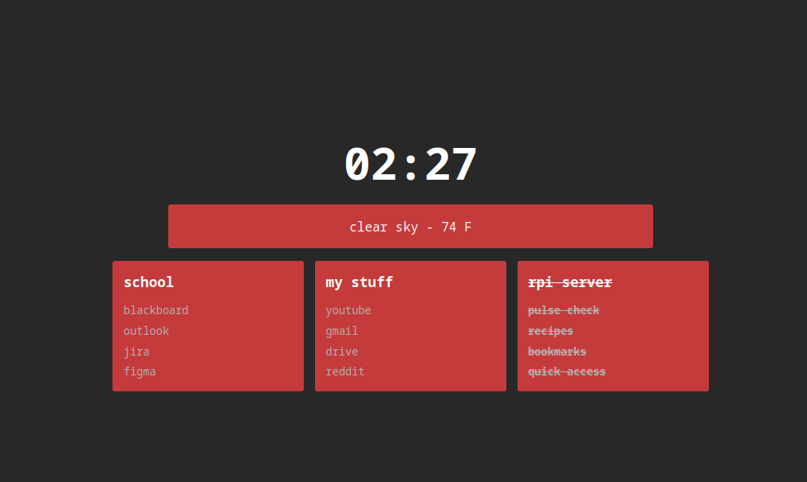
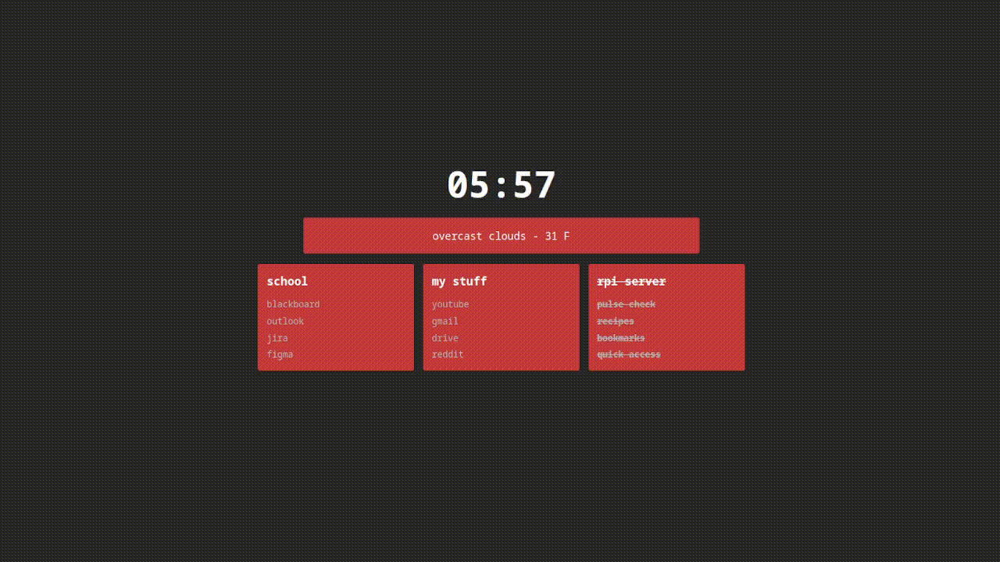

<h1 align="center">
  <br>
  Homepage
  <br>
</h1>

<h4 align="center">Browser Homepage</h4>

<p align="center">
  <a href="#key-features">Key Features</a> •
  <a href="#how-to-use">How To Use</a> •
  <a href="#bookmarks-structure">Bookmarks Structure</a> •
  <a href="#modes">Modes</a> •
  <a href="#commands">Commands</a> •
  <a href="#credits">Credits</a> •
  <a href="#related">Related</a> •
  <a href="#license">License</a>
</p>



## Key Features

* Clock
* Weather
* Command Mode
* Web Search
* Bookmark Search

## How To Use

1. Clone or download the repo
2. Add a `bookmarks.js` file
3. <a href="#bookmarks-structure">Populate</a> the file with your bookmark data
4. Set `index.html` to be your browser's homepage

## Bookmarks Structure
The bookmark structure consists of an array of objects; each object has a title property and an array of links.

```js
const bookmarks = [
    {
        title: "Section 1",
        links: [
            {name: "bookmark 1", url: "https://bookmarkURL1.com/"},
            {name: "bookmark 2", url: "https://bookmarkURL2.com/"},
            {name: "bookmark 3", url: "https://bookmarkURL3.com/"},
            {name: "bookmark 4", url: "https://bookmarkURL4.com/"},
        ]
    },
    
    {
        title: "Section 2",
        links: [
            {name: "bookmark 1", url: "https://bookmarkURL1.com/"},
            {name: "bookmark 2", url: "https://bookmarkURL2.com/"},
            {name: "bookmark 3", url: "https://bookmarkURL3.com/"},
            {name: "bookmark 4", url: "https://bookmarkURL4.com/"},
        ]
    },
    
    {
        title: "Section 3",
        links: [
            {name: "bookmark 1", url: "https://bookmarkURL1.com/"},
            {name: "bookmark 2", url: "https://bookmarkURL2.com/"},
            {name: "bookmark 3", url: "https://bookmarkURL3.com/"},
            {name: "bookmark 4", url: "https://bookmarkURL4.com/"},
        ]
    },
];
```

You also need other constant variables: 
```js
//URL to my local server
const serverIpUrl = "http://local-server-url/";

//Index of the server section
const serverIndex = 2;

//Weather API url
const weatherAPI = "http://weather-api-url.com/";
```

## Modes

***Command Mode***

Press the \ key to run a <a href="#commands">command</a>

***Web Search***

Press the SPACE bar to web search using the set search engine


***Bookmark Search***

Press the CTRL key to go to your bookmark url based on its name

## Commands

`color [color]`

Change the main color of the homepage (hex or name)



`engine [engine]`

Change the search engine used (google or duck)

## Credits

I based this on <a href="https://github.com/Jaredk3nt/homepage">Jaredk3nt's original homepage design</a> and added a few features of mine.

## Related

[Homepage Mobile](https://github.com/null-integer/homepage-mobile) - The mobile version of this repo

## License

MIT

---
>GitHub [@null-integer](https://github.com/null-integer)
